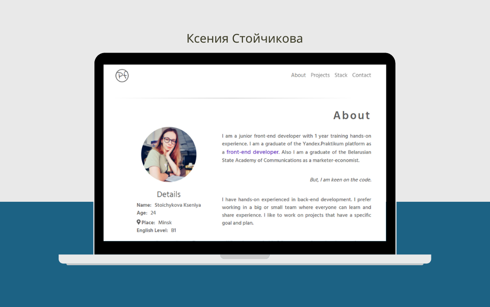

# Портфолио Junior Front end Developer

### Обзор
* Интро
* Технологии
* Текущий статус
* Техническое описание

## Интро

Проект Портфолио - одностраничный адаптивный сайт-портфолио на React.js. Сайт развернут на **github.pages**. В портфолио представлены основные проекты, разработанные в рамках обучения на платформе Яндекс.Практикум, включая само портфолио и 1 проект от платформы Udemy. Подробное CV можно найти на сайте. Проект создан на React.
## Технологии 

1. React, Hooks
2. Стилизация по БЭМ
3. Стили на SCSS, с использованием переменных CSS (первый опыт)
4. Применение Suspense, lazy  для разделения кода и установки прелоадера
5. Вёрстка с использованием Flex и  Grid блоков
## Текущий статус

В проекте требуются доработки. Сейчас он доступен в работающем, но не доделанном виде, т.к. я нахожусь в поисках работы. 

**Какие доработки я планирую сделать?**
1. Причесать CSS файлы, почистить код от комментариев
2. Создание серверной части с express.js 
3. Оптимизация сайта при помощи Lighthouse и прочих инструментов для проверки.

Если у вас есть комментарии или предложения - буду благодарна вашим письмам [моя почты](kseniya7991@gmail.com) 

## Техническое описание
# `npm start`

Запуск приложения в режиме разработки.
Запускается здесь [http://localhost:3000](http://localhost:3000) 
# `npm run build`

Оптимизированная сборка проекта для режима производства.
Собранный проект находится в папке `build`.

>Если вы хотите связаться со мной - все ссылки есть тут [github kseniya7991](https://github.com/kseniya7991) 

